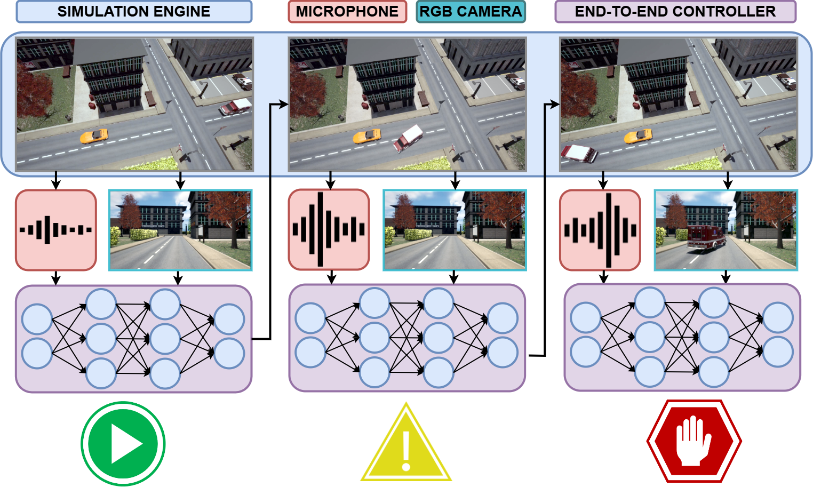

# LiSA - Listen, See and Act

---

<div class="logo">

</div>
Official Repository of the Project LiSA: fusing audio-video cues to perceive visible and invisible events and develop 
perception-to-action solutions for autonomous vehicles. 

 PNRR-M4C2 – I1.1 – MUR Call for proposals n. 1409 del 14-09-2022 - Bando PRIN 2022 PNRR - ERC sector PE6 - 
 Project title: "LiSA - Listen, See and Act: fusing audio-video cues to perceive visible and invisible events and 
 develop perception-to-action solutions for autonomous vehicles" - Project Code P2022MEBFM - CUP Code D53D23017510001 - 
 Funded by the European Union - NextGenerationEU


### License 

---

LiSA Dataset is released under the following License:

Attribution-NonCommercial-ShareAlike 3.0 [CC BY-NC-SA 3.0](LICENSE).

This means it is possible:
* to copy, distribute, display, and perform the work. 
* to make derivative works.

Under the following conditions:</br>
 - Attribution: You must give the original author credit.</br>
 - Non-Commercial — You may not use this work for commercial purposes. </br>
 - Share Alike — If you alter, transform, or build upon this work, you may distribute the resulting work only under a 
licence identical to this one.

---

## The LiSA Project

<div class="lisa">

</div>

The development of a more circular economy is a key stepstone to reduce the environmental impact of the production and
distribution systems, guarantee supply chains of strategic material and favour the economic growth. In this context, 
transportation services play a crucial role and enhancing them to favour sustainability, inclusiveness and safety is 
fundamental.  

Most of the advancements in transportation systems have been made possible by Artificial Intelligence (AI) 
methodologies, which facilitated the development of autonomous vehicles (AVs). However, despite the impressive results 
demonstrated, there are still many open challenges that prevent AVs to be fully integrated in mobility services. 
Most of the limitations that affect these systems are related to the capability to effectively perceive the entities 
and the events of the environment and compute timely navigation and reaction commands.  

Inspired by the previous considerations, this project aims to empower AVs with novel perception-to-action capabilities
that rely on multiple and heterogeneous data sources. In particular, the combination of visual and audio information 
allows computing a more robust, efficient, and descriptive representation of the vehicle's surroundings.  

Being able to predict the occurrence of visual events long before they can actually be seen means increasing 
the driver’s “time allowance” to properly react to those events. Such allowance is even more significant in case of AVs,
operating both in a full or semi-autonomy regime. Yet, the use of sound is greatly under-investigated in the intelligent 
transportation systems community and driverless vehicles are, still, largely deaf.

This project aims to tackle this problem by:
- Detecting and localising acoustic events in urban scenarios.
- Generating joint representation of audio/visual events to enable the development of multi-modal systems that model 
spatiotemporal relationship of audio/visual inputs.
- Developing perception-to-action methodologies to map audio-visual cues to vehicle control commands and improve the 
autonomous navigation capabilities.

## Simulated Dataset

---

We built an urban environment in Unreal Engine in which the scene consists of an intersection with an ambulance, 
in accordance with the reference scenarios of the project. For the data collection, we have deployed a simulated car 
in the environment equipped with an RGB camera and 4 microphones. The RGB camera is mounted in a forward-facing position, 
ensuring that parts of the car are not within the field of view. 
Meanwhile, the 4 microphones are mounted at the four corners of the car. Each sequence is composed of 20 seconds 
of driving. During these sequences, data are collected at a sampling frequency of 20 Hz. 

#### LINK DATASET DOWNLOAD

http://sira.diei.unipg.it/supplementary/public/Datasets/LiSA/

### Data Organization

---

For each sequence in the dataset, there is a well-organized folder structure to ensure easy access and analysis. 
The structure is as follows:

```
LiSA Dataset
├── Sequence_0
│   ├── gt.csv
│   ├── microphones.txt
│   ├── images
│   │     ├── img_0.png
│   │     ├── img_1.png
│   │     ├── ...
│   │     └── img_n.png
│   ├── sound
│         ├── original.wav
│         ├── output_0.wav
│         ├── ...
│         └── output_3.wav
├── ...
└── Sequence_n
│   ├── gt.csv
│   ├── microphones.txt
│   ├── images
│   │     ├── img_0.png
│   │     ├── img_1.png
│   │     ├── ...
│   │     └── img_n.png
│   ├── sound
│         ├── original.wav
│         ├── output_0.wav
│         ├── ...
│         └── output_3.wav
```